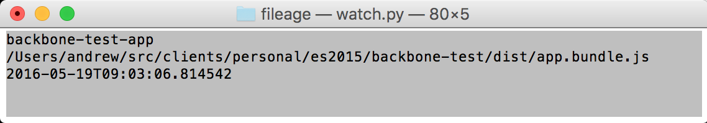

# File Age Dashboard

This project is a CLI-based dashboard giving a color-coded view of how
recently files have changed and whether they contain expected input.



This is useful for files that are automatically generated by build
tools such as `Webpack` or `grunt watch`. You might leave this peeking
out behind your browser, letting you know when a new build is done and
whether it failed.

Tested on OSX 10.11, El Capitan, Python version 2.7. Depends upon
[argparse](https://pypi.python.org/pypi/argparse), which is provided
in Python >= 2.7 and >= 3.2.

## Usage

### Basic

At the simplest, you can execute `./bin/watch.py` with a `-f` followed
by the filenames to watch. For example:

```
./bin/watch -f ../web-project/dist/app.bundle.js
```

It will fill the terminal with colors indicating the status of the file.

<dl>
    <dt>Missing</dt>
    <dd>Magenta</dd>

    <dt>New</dt>
    <dd>Green</dd>

    <dt>Recent</dt>
    <dd>Yellow</dd>

    <dt>Older</dt>
    <dd>Gray</dd>
</dl>

A file is considered **New** if its modified time is less than 3
seconds ago, and **Recent** if the time is less than 10 seconds ago.

You can supply many files following the `-f`, and they will stack
vertically in the dashboard view.

### Success Criteria

Additionally, you can supply a success criteria with the `-s` argument.

```
./bin/watch -f ../web-project/dist/app.bundle.js -s "^require\("
```

The value is a regular expression to be compiled by python's
[re.compile](https://docs.python.org/2/library/re.html#re.compile)
function.

When supplied, if the file exists but _no lines_ in the file match the
regular expression, then the build is considered a failure and the
dashboard will display the color Red for that entry.

This success criteria will apply to all filenames provided on the
command line.

### Configuration

You can also build a list of files to watch with a configuration file.

The default configuration file path is `config/dev.ini` within this
project.

For example:
```
[fileage]

filename-prefix: /Users/andrew/projects
javascript-app-filename: /browserify-project/dist/app.bundle.js
javascript-app-success-pattern: ^require=\(
```

where:

<dl>
    <dt><code>&lt;label&gt;-filename</code></dt>
    <dd>path to a file to watch.</dd>

    <dt><code>&lt;label&gt;-success-pattern</code></dt>
    <dd>regexp defining success for the same <code>&lt;label&gt;</code>'s filename.</dd>

    <dt><code>filename-prefix</code></dt>
    <dd>(optional) a common home for all relative filename paths</dd>

    <dt><code>global-success-patter</code></dt>
    <dd>success regexp to apply to all filenames that don't have their own success criteria.</dd>
</dl>

Note that the `[fileage]` section header is required.

#### Additional Configuration

To change what is considered "new" and "recent" for coloring purposes,
you can change the thresholds with these options:

<dl>
    <dt><code>new-age-seconds</code></dt>
    <dd>The number of seconds to consider a file "new". That is, when
    subtracting the current time from the modified time, if it is less
    than <code>new-age-seconds</code>, consider it new. This value is
    a float, so you can provide subseconds. Default: <code>3.0</code>
    </dd>

    <dt><code>young-age-seconds</code></dt>
    <dd>The number of seconds to consider a file "recent". This is a
    float, so you can provide subseconds. Default: <code>10.0</code>
    If you set it less than or equal to <code>new-age-seconds</code>,
    then the "recent" color will never be used.
    </dd>
</dl>

The dashboard polls the files for their status at two rates, depending
on whether the files have changed recently. When we've seen a change,
we check again more frequently to give better visibility into the
age. This is the "hot" period. After some time, we "cool" off and
check less frequently. To configure these hot and cool polling
periods, you can use the following configuration options in the
`[fileage]` section:

<dl>
    <dt><code>short-sleep-duration</code></dt>
    <dd>How long in seconds to wait before checking file age in "hot"
    period. This is a float, so you can provide subseconds. Default:
    `0.3`</dd>

    <dt><code>long-sleep-duration</code></dt>
    <dd>How long in seconds to wait before checking file age in "cool"
    period. This is a float, so you can provide subseconds. Default:
    `0.7`</dd>

    <dt><code>short-sleep-period-seconds</code></dt>
    <dd>How long in seconds to stay in the "hot" period before cooling
    off.</dd>
</dl>

### Tips

If you are a big command line user on a Mac, you probably already have
[iTerm](https://www.iterm2.com/) installed. You might want to run this
in OSX's native `terminal` program to keep the dashboard tucked away,
out of your CMD-tab cycle.
